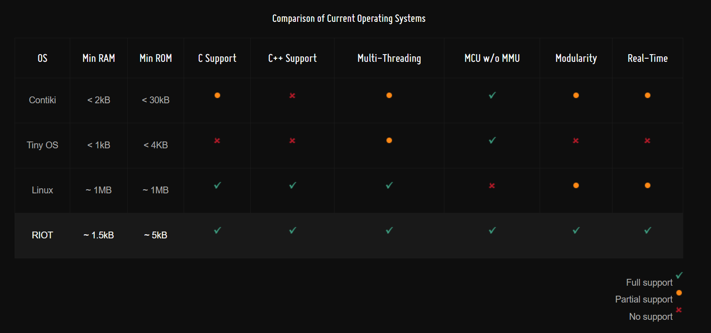

#RTOS Selection

An RTOS or simple scheduler is desired to provide a layer of abstraction and program threading within the Faraday hardware. The CC430F6137 is quite minimal and many larger OS's cannout but used. The selection criteria is listed below:

* Adequate community support and documentation
* ROM and RAM needed to operate must be reasonable within the 4kb RAM nd 32Kb ROM
* An "open source" license
  * GPL, BSD, etc...

## RTOS's Available

* [RIOT - RTOS](https://riot-os.org/)
  * LGPL license
  * A very minimal, popular, supported RTOS for the internet of things
  * Has been [used on CC430F6137](https://github.com/RIOT-OS/RIOT/wiki/Board:-eZ430-Chronos)
* [TI-RTOS](http://www.ti.com/tool/TI-RTOS)
  * BSD license
  * TI supported but fairly large
* [TinyOS](http://www.tinyos.net/)
  * BSD license
  * Small but still significant portion of CC430F6137
  * Prior use on MSP430 devices but not sure about CC430F6137
* [Freertos](https://www.google.com/url?sa=t&rct=j&q=&esrc=s&source=web&cd=1&cad=rja&uact=8&ved=0ahUKEwjPytKIvM3XAhWKg1QKHUf3DVEQFggoMAA&url=http%3A%2F%2Fwww.freertos.org%2F&usg=AOvVaw3zB3DXX1lQcsp2QaeRMeva)
  * FreeRTOS Open Source License?
  * Use on MSP430 line devices
  * Well supported but fairly large?

#### MCU Operting Systems Comparison

Source of this chart is: https://riot-os.org/#features




### RIOT implementation

RIOT looks like a great first path to follow for the Faraday firmware needed. I will be following the [RIOT - OS Tutorials](https://github.com/RIOT-OS/Tutorials/blob/master/README.md) and installing the needed software/source into a Lubuntu virtual box instance.

* I am not using Vagrant and instead following tutorial to build RIOT on the lubuntu VM itself.
* I needed to install `gcc-multilib` per documentation
* Installing OpenOCD (https://github.com/RIOT-OS/RIOT/wiki/OpenOCD)

The OpenJTAG and other adapters were not configured? Not sure if this really matters...

```
OpenOCD configuration summary
--------------------------------------------------
MPSSE mode of FTDI based devices        yes (auto)
ST-Link JTAG Programmer                 yes (auto)
TI ICDI JTAG Programmer                 yes (auto)
Keil ULINK JTAG Programmer              yes (auto)
Altera USB-Blaster II Compatible        yes (auto)
Versaloon-Link JTAG Programmer          yes (auto)
OSBDM (JTAG only) Programmer            yes (auto)
eStick/opendous JTAG Programmer         yes (auto)
Andes JTAG Programmer                   yes (auto)
USBProg JTAG Programmer                 yes (auto)
Raisonance RLink JTAG Programmer        yes (auto)
Olimex ARM-JTAG-EW Programmer           yes (auto)
CMSIS-DAP Compliant Debugger            yes (auto)
Cypress KitProg Programmer              yes (auto)
Altera USB-Blaster Compatible           no
ASIX Presto Adapter                     no
OpenJTAG Adapter                        no
SEGGER J-Link Programmer                yes (auto)

```

Looks like the compiling and installing worked!

```
brent@brent-VirtualBox:~/GIT/openocd$ openocd --version
Open On-Chip Debugger 0.10.0+dev-00207-g41092636 (2017-11-20-08:12)
Licensed under GNU GPL v2
For bug reports, read
	http://openocd.org/doc/doxygen/bugs.html
brent@brent-VirtualBox:~/GIT/openocd$
```

* I'm deciding not to install the ARM support as indicted in the tutorial since MSP430 development isn't ARM.

OK so I ran into trouble running the first tutorial and decided to go back and use `./configure` with the optional enables to ensure all packages were installed. I used `make uninstall` prior.

```
OpenOCD configuration summary
--------------------------------------------------
MPSSE mode of FTDI based devices        yes (auto)
ST-Link JTAG Programmer                 yes (auto)
TI ICDI JTAG Programmer                 yes (auto)
Keil ULINK JTAG Programmer              yes (auto)
Altera USB-Blaster II Compatible        yes (auto)
Versaloon-Link JTAG Programmer          yes (auto)
OSBDM (JTAG only) Programmer            yes (auto)
eStick/opendous JTAG Programmer         yes (auto)
Andes JTAG Programmer                   yes (auto)
USBProg JTAG Programmer                 yes (auto)
Raisonance RLink JTAG Programmer        yes (auto)
Olimex ARM-JTAG-EW Programmer           yes (auto)
CMSIS-DAP Compliant Debugger            yes (auto)
Cypress KitProg Programmer              yes (auto)
Altera USB-Blaster Compatible           yes
ASIX Presto Adapter                     yes
OpenJTAG Adapter                        yes
SEGGER J-Link Programmer                yes (auto)

brent@brent-VirtualBox:~/GIT/openocd$
```

Now since the tutorial uses and ARM processor I'm going to install the ARM support.

OK I installed all including the GCC Arm Toolchain.
I still run into this problem:

```
brent@brent-VirtualBox:~/GIT/RIOT-OS/Tutorials/task-01$ make all term
Building application "Task01" for "native" with MCU "native".

"make" -C /home/brent/GIT/RIOT-OS/Tutorials/RIOT/boards/native
"make" -C /home/brent/GIT/RIOT-OS/Tutorials/RIOT/boards/native/drivers
"make" -C /home/brent/GIT/RIOT-OS/Tutorials/RIOT/core
"make" -C /home/brent/GIT/RIOT-OS/Tutorials/RIOT/cpu/native
/home/brent/GIT/RIOT-OS/Tutorials/RIOT/cpu/native/startup.c: In function ‘startup’:
/home/brent/GIT/RIOT-OS/Tutorials/RIOT/cpu/native/startup.c:292:17: error: this statement may fall through [-Werror=implicit-fallthrough=]
                 usage_exit(EXIT_SUCCESS);
                 ^~~~~~~~~~~~~~~~~~~~~~~~
/home/brent/GIT/RIOT-OS/Tutorials/RIOT/cpu/native/startup.c:293:13: note: here
             case 'i':
             ^~~~
cc1: all warnings being treated as errors
/home/brent/GIT/RIOT-OS/Tutorials/RIOT/Makefile.base:81: recipe for target '/home/brent/GIT/RIOT-OS/Tutorials/task-01/bin/native/cpu/startup.o' failed
make[2]: *** [/home/brent/GIT/RIOT-OS/Tutorials/task-01/bin/native/cpu/startup.o] Error 1
/home/brent/GIT/RIOT-OS/Tutorials/RIOT/Makefile.base:20: recipe for target 'ALL--/home/brent/GIT/RIOT-OS/Tutorials/RIOT/cpu/native' failed
make[1]: *** [ALL--/home/brent/GIT/RIOT-OS/Tutorials/RIOT/cpu/native] Error 2
/home/brent/GIT/RIOT-OS/Tutorials/task-01/../RIOT/Makefile.include:297: recipe for target 'all' failed
make: *** [all] Error 2
brent@brent-VirtualBox:~/GIT/RIOT-OS/Tutorials/task-01$
```
